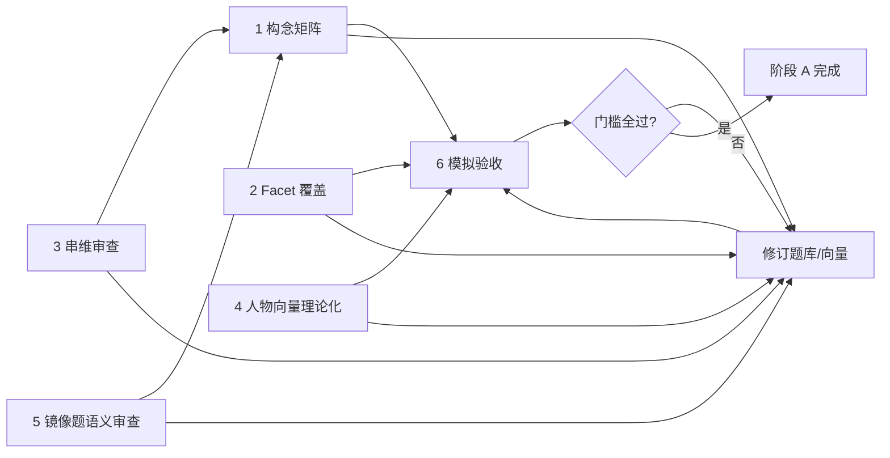

# 阶段 A 计划：零样本理论优化

> 人物志（Figure Atlas）在采集真人数据之前，通过理论模型与工程模拟完成的题库与人物库优化方案。  
> 版本：v1 · 2026-07

## 目标与边界

**目标**：在不采集真人数据的前提下，将产品从「Big Five 框架 + 透明计分」提升到「**构念对齐可审计、人物向量有理论依据、工程指标有验收门槛**」。

**边界**：阶段 A 完成后，产品仍应表述为「按 Big Five 设计的情境倾向测试」，**不得**声称已通过 BFI/NEO 验证或具备临床/招聘级信效度。

**周期建议**：

- 1 人兼职：2–3 周
- 全职集中：8–10 个工作日（原估 5–7 天偏乐观，57 人 rationale 化是最大工时项，见任务 6）

> 57 人 × 约 15 分钟纯撰写 ≈ 14 小时，加上查理论区间表、比对最近邻、改向量重跑 validate，实际更接近 20–25 小时。若时间紧，按任务 6 的分批策略执行，不要压缩审题环节。

## 总览：六条工作流



| 编号 | 工作流 | 主要产出 | 依赖 |
| --- | --- | --- | --- |
| A1 | 构念对齐矩阵 | 40 题 × 1 张审查表 | 无 |
| A2 | Facet 覆盖审计 | 五维 facet 覆盖图 + 缺口清单 | A1 |
| A3 | 串维 / 内容审查 | 每题串维风险评级 + 改题清单 | A1 |
| A4 | 人物向量理论化 | 57 人「原型 → 向量」说明 + 修订向量 | A1 |
| A5 | 镜像题语义审查 | 10 对镜像的语义一致性说明 | A1 |
| A6 | 模拟验收 | 分布报告 + 阈值建议 | A4 + 题库定稿 |

---

## Week 0：开工前基线检查（半天）

在动任何题库或向量之前，先记录现状基线，否则改完无法量化「阶段 A 带来了多少改善」。

```powershell
npm test
npm run validate
node scripts/simulate-test.mjs
```

记录以下数值到 `docs/phase-a-baseline.md`（或本文档附录）：

- 不可达人物数、标准化距离 < 0.065 的人物对数
- 正态模拟下 Top1 人物占比、出现过的主原型数
- 双原型率、辨析触发率分布、最终前两名平均距离差

后续任务 7 的模拟验收以这组基线为对照。

---

## Week 1：题库理论审计（A1 + A2 + A3 + A5）

### 任务 1 — 建立构念对齐矩阵（A1）

**对象**：`src/data/questions.mjs` 中 25 道核心题 + 15 道辨析题。

**交付物**：[`docs/construct-matrix.csv`](./construct-matrix.csv)（40 行，一题一行）。

**核心题与辨析题的审查强度不同**：

- 40 题全部进矩阵并标注 `primary_facet` / `cross_load_risk`，便于追溯。
- 但 **facet 覆盖门槛（任务 2）只针对 25 道核心题**。辨析题的功能是「在前两名人物差异最大的维度上拉开差距」，不是测量主维度构念；为补 facet 而强行改辨析题，会损害其区分功能。
- 辨析题仍需做串维红标检查（🔴 = 0），但不必满足「每维 ≥3 facet」。

**字段定义**：

| 字段 | 说明 |
| --- | --- |
| `id` | 题号，如 `O1`、`OX1` |
| `dimension` | `O` / `C` / `E` / `A` / `R` |
| `domain` | 已有五类场景领域 |
| `primary_facet` | 对应 NEO 简版 facet（见下表） |
| `secondary_facet` | 可选，次相关 facet |
| `high_pole_behavior` | 选 `+3` 时在测什么（一句话） |
| `low_pole_behavior` | 选 `-3` 时在测什么 |
| `forbidden_load` | 不应同时测量的维度 |
| `value_monotonic` | 四档是否单调体现构念：`Y` / `需改` |
| `status` | `pass` / `revise` / `replace` |

**NEO facet 对照表（审查用，不必写进产品 UI）**：

| 维 | 常用 facet（每题 primary 选 1 个即可） |
| --- | --- |
| O | Ideas（新思路）、Actions（尝新）、Fantasy / Values |
| C | Self-Discipline、Order、Achievement Striving、Deliberation |
| E | Gregariousness、Assertiveness、Activity、Warmth |
| A | Altruism、Compliance、Straightforwardness、Trust |
| R | 对应低 N：Anxiety、Vulnerability、Self-Consciousness、Impulsiveness（反向） |

**重要：facet 借鉴 NEO，是映射而非等同**。本项目的维度命名（O 探索开放 / C 结构执行 / E 外向驱动 / A 协作共情 / R 复原稳定）并非直接照搬 BFI/NEO，四维大致同构，**R 维尤其需要注意**：

- NEO 里对应的是「神经质 N」，高分 N = 易焦虑；产品对外讲的是「复原稳定」，高分 R = 不易焦虑、恢复快。
- 二者构念相关但不完全相同：「不易焦虑」与「恢复快」在题目上可能落到不同行为。
- 因此 R 维题目若 `primary_facet` 落在 Anxiety / Self-Consciousness / Vulnerability，高分端（+3）应体现「不被焦虑占用 / 不反刍」，而非单纯的「恢复速度」。

这张映射关系最终要写进 `TEST_LOGIC.md` 的「R 维定义」一节，避免出现「题目测焦虑敏感、分数却叫复原稳定」的解释裂缝。

**完成标准**：40 题全部有 `primary_facet`；无题留空 `forbidden_load`。

---

### 任务 2 — Facet 覆盖审计（A2）

**做法**：按维度统计 `primary_facet` 出现次数，绘制 5×6 覆盖矩阵。

**当前基线判断（基于现有题库，需在矩阵填完后复核）**：

| 维 | 覆盖较好的 facet | 明显缺口 |
| --- | --- | --- |
| O | Ideas、Actions | Aesthetics / Feelings 几乎无 |
| C | Order、Self-Discipline | Deliberation（审慎决策）偏弱 |
| E | Gregariousness、Assertiveness | Warmth 与 Activity 可再分 |
| A | Altruism、Compliance | Straightforwardness 与 Trust 可拆开 |
| R | Anxiety / Vulnerability（间接） | 偏「恢复速度」，少测「易焦虑 / 易反刍 / 社交评价敏感」 |

**规则**：

- 每维 **至少覆盖 3 个不同 facet**（25 题短测验的合理下限）
- **R 维至少 2 题** 的 `primary_facet` 明确落在 Anxiety / Self-Consciousness / Vulnerability
- 同一 facet **不超过 3 题**（避免窄化）

**约束冲突时的优先级**：每维只有 5 道核心题，同时要满足 5 domain 全覆盖、≥3 facet、同一 facet ≤3 题、2 组镜像、≥2 反向呈现、选项混排 ≥2。这些约束在 5 题尺度下很可能撞车（例如为补 R 的 Anxiety facet，可能被迫破坏 domain 分布或镜像配对）。冲突时按下表让位，避免反复返工：

| 优先级 | 约束 | 让位时的处理 |
| --- | --- | --- |
| 1（最高） | 每维 5 题、5 domain 全覆盖、2 组镜像 | 不让位，是题库骨架 |
| 2 | 串维 🔴 = 0 | 必须改题或改分值 |
| 3 | 每维 ≥3 facet | 若实在不够，记入缺口清单而非硬凑 |
| 4 | 同一 facet ≤3 题 | 可豁免 1 处并备注 |
| 5 | ≥2 反向呈现、选项混排 ≥2 | 可豁免并备注 |

**交付物**：facet 覆盖表（可附于本文档或单独 `docs/facet-coverage.md`）+ **缺口清单**。

**完成标准**：五维均 ≥3 facet；R 维满足上条；缺口题列入 Week 2 改题名单。

---

### 任务 3 — 串维 / 内容审查（A3）

**做法**：对每题四个选项检查：

1. 若选某选项，**另一维度的典型高分者是否也会选它？**
2. 选项收益是否混合两种特质（如「按计划 + 讨好大家」）？
3. 是否测 **能力 / 经验** 而非 **倾向**（如 E4「总结并带着聊」偏领导力技能）？

**优先复核题（首批人工审）**：

| 题号 | 疑点 |
| --- | --- |
| A3 | 「整体收益 vs 照顾投入者」——C 与 A 边界 |
| A4 | 「信任新人 vs 风险控制」——A 与 C / R 边界 |
| C2 | 「先做最影响心情的」——C 与情绪 / R 边界 |
| E2 vs E3 | 镜像对：独处恢复 vs 边聊边想——是否都测 E 而非 O |
| R5 | 「先排顺序」偏 C，「压力上来先缓缓」才是 R |

**评级**：

- 🟢 无串维
- 🟡 轻度（可保留并备注）
- 🔴 需改题或改分值

**交付物**：在 `construct-matrix.csv` 增加列 `cross_load_risk`（green / yellow / red）。

**完成标准**：🔴 = 0；🟡 每维 ≤ 1 道，且有书面豁免说明。

---

### 任务 4 — 镜像题语义审查（A5）

**对象**：`MIRROR_PAIRS` 中 10 对（见 `src/data/questions.mjs`）。

每对需回答：**两题在语义上是否测量同一取向？** 不能仅靠「都是 O 维场景」。

| 对 | 需回答的问题 |
| --- | --- |
| O1–O4 | 都是「对新方法 / 新工具的态度」？ |
| O2–O5 | 都是「学习 / 探索范围宽窄」？ |
| C1–C5 | 都是「无外部监督下的自我驱动结构」？ |
| C2–C4 | 都是「个人事务的组织程度」？ |
| E1–E5 | 都是「社交场合主动程度」？ |
| E2–E3 | **风险最高**：工作讨论 vs 周末恢复，是否同一 E 构念？ |
| A1–A5 | 都是「冲突中合作 vs 原则」？ |
| A2–A4 | 都是「对他人的信任 / 支持 vs 直接」？ |
| R1–R4 | 都是「挫折后恢复节奏」？ |
| R2–R3 | 都是「对负面信息的情绪占用」？ |

**交付物**：[`docs/mirror-pairs.md`](./mirror-pairs.md)（10 段同向证明；必要时更新 `MIRROR_PAIRS` 与题目）。

**完成标准**：10 对全部有书面同向证明；E2–E3 要么证明通过，要么替换其中一题。

---

## Week 2：修订 + 人物向量理论化（A4 + 改题）

### 任务 5 — 题库修订

**原则**：

- 优先 **改文案 / 改分值**，不轻易增删题号（避免破坏 25 题结构与现有测试）
- 若必须替换：保持 `id`、维度、`domain`、四档分值 `-3/-1/+1/+3` 不变
- 改完运行：

```powershell
npm test
npm run validate
```

**改题优先级**：

1. 🔴 串维题
2. R 维 facet 缺口
3. 镜像对语义不成立
4. facet 过度集中（同一 facet > 3 题）

**交付物**：[`docs/question-changelog.md`](./question-changelog.md)（每题：改了什么、为何、对应 facet）。

**完成标准**：`scripts/validate-questions.mjs` 通过；单测「改一题只动一维」仍成立。

---

### 任务 6 — 人物向量理论化（A4）

**现状问题**：57 人的 `{ O, C, E, A, R }` 多为叙事直觉赋值，缺乏可追溯依据。

**新流程（每人约 15 分钟，可分批）**：

```text
Step 1  写 1 句 archetype（可从现有 bio 提炼）
Step 2  勾选 2–3 个 Big Five 原型标签（见下表）
Step 3  按标签查「理论区间表」得各维区间
Step 4  在区间内取点，写 1 句理由
Step 5  与最近邻 3 人比对，确保距离 ≥ validate 门槛
```

**理论区间表示例**（可在 [`docs/figure-archetype-ranges.md`](./figure-archetype-ranges.md) 中固化）：

| 原型标签 | O | C | E | A | R |
| --- | --- | --- | --- | --- | --- |
| 系统规划者 | 中偏高 | 很高 | 低~中 | 中 | 中高 |
| 逍遥避世者 | 很高 | 很低 | 很低 | 中 | 很高 |
| 铁律改革者 | 中 | 很高 | 中 | 很低 | 中高 |
| 兼爱实践者 | 偏高 | 高 | 中低 | 高 | 中 |
| 情绪敏感求索者 | 很高 | 中高 | 中低 | 高 | 很低 |

**约束（与 `scripts/validate-figures.mjs` 对齐）**：

- 每人向量在 `[10, 98]`
- 57 人在 grid 穷举下均可达
- 任意两人标准化距离 **≥ 0.065**
- 每人须是**自己向量的最近邻**（见 `test/data-contract.test.mjs`）

**`rationale` 的落地方式（动工前必须定）**：现有 `src/data/figures.mjs` 每人字段是 `{ id, name, era, archetype, vector, tags, bio }`，而 `TEST_LOGIC.md` §6 写的是 `narrativeBasis`——文档与实现本就不一致，阶段 A 顺手统一。推荐方案：

- `figures-rationale.json` 作为**单一事实来源**存 `{ id, tags[], vector, rationale }` × 57。
- `figures.mjs` 增加从 rationale JSON 读取的 `rationale` 字段（或把 `bio` 改名为 `narrativeBasis` 并与 rationale 合并），同步更新 `test/data-contract.test.mjs` 的 schema 断言。
- `scripts/validate-figures.mjs` 或新增的 `validate:phase-a` 交叉校验 JSON 与 `figures.mjs` 的 id / vector 一致。

**分批策略（应对工时风险）**：57 人不要一次性走完。先做 20 人（覆盖各类原型标签）走完整 Step 1–5，验证「理论区间表」是否好用、距离门槛是否好满足；调整区间表后再批量做余下 37 人。这样能避免区间表设计缺陷导致全量返工。

**交付物**：[`docs/figures-rationale.json`](./figures-rationale.json) — `{ id, tags[], vector, rationale }` × 57；必要时更新 `src/data/figures.mjs`。

**完成标准**：`npm run validate` 人物部分通过；随机抽 5 人，外人能读懂「向量为何如此」。

---

## Week 3：模拟验收 + 门槛固化（A6）

### 任务 7 — 扩展模拟报告

**状态：已完成**（2026-07-07，见 [`phase-a-task7-report.md`](./phase-a-task7-report.md)）

在现有 `scripts/simulate-test.mjs` 与 `scripts/validate-figures.mjs` 基础上，补充（已实现为 `scripts/phase-a-report.mjs`）：

| 指标 | 含义 | 建议门槛（首版） |
| --- | --- | --- |
| 人物集中度 | 正态模拟下 Top1 人物占比 | 单人 < 8% |
| 双原型率 | 完整自适应流触发双原型比例 | 5%–25% |
| 辨析触发率 | 需 1–3 道辨析题的比例 | 20%–50% |
| 不可达人物 | grid 穷举 winner = 0 | **0** |
| 极近人物对 | 标准化距离 < 0.065 | **0** |
| 阈值敏感性 | 0.025 / 0.035 / 0.045 下双原型率 | 选使分布落在区间的值 |

**交付物**：终端报告；若调整 `0.035` / `0.01`，同步更新 [`TEST_LOGIC.md`](../TEST_LOGIC.md) 阈值说明。

**完成标准**：上表全部过线；若不过线，回到任务 5 或 6 调整。**当前 5/5 达标**（辨析 gap 阈值经敏感性扫描定为 0.015）。

---

### 任务 8 — 自动化守门（推荐）

把阶段 A 可机器检查的部分挂进 CI：

| 检查项 | 实现方式 |
| --- | --- |
| 构念矩阵存在且 40 题齐全 | `scripts/validate-construct.mjs` 读 CSV |
| 每维 ≥ 3 facet | 同上 |
| 无 red 串维标记 | CSV 中 `cross_load_risk != red` |
| 人物 rationale 57 条齐全 | JSON schema 校验 |
| 模拟指标 | `phase-a-report.mjs` 非零 exit code |

**目标命令**：`npm run validate:phase-a`（可与现有 `npm run validate` 并列）。

---

## 阶段 A 总验收清单

全部打勾才算阶段 A 完成。

### 题库

- [ ] 40 题构念矩阵完整，可对外展示「每题在测什么」
- [ ] 五维 facet 覆盖 ≥ 3，R 维含 Anxiety / Self-Consciousness / Vulnerability 类题
- [ ] 串维 🔴 = 0，🟡 有书面豁免
- [ ] 10 对镜像题有语义同向说明
- [ ] `npm test` + `npm run validate` 通过

### 人物

- [x] 62 人各有 `rationale` + 2–3 个理论标签（见 `docs/figures-rationale.json`）
- [ ] 向量调整有依据，非纯叙事拍脑袋
- [ ] 不可达 / 极近对 / 自最近邻 全过

### 工程

- [x] 模拟报告：集中度、双原型率、辨析率在建议区间
- [x] 阈值有文档说明（辨析 gap 0.015、双原型 gap 0.01，含敏感性扫描依据）
- [x] 产品文案仍不含「已科学验证」「BFI 相关」等表述

### 文档

- [ ] [`TEST_LOGIC.md`](../TEST_LOGIC.md) 增补「阶段 A 理论对齐」摘要（完成日期、facet 策略、R 维定义、向量方法、模拟门槛）

---

## 分工与时间（参考）

| 天 | 重点 |
| --- | --- |
| D0（半天） | 跑 validate + simulate，记录基线 |
| D1–D2 | 填完 25 核心题构念矩阵（模板已就绪） |
| D3 | 填 15 辨析题 + facet 覆盖图 |
| D4 | 串维审查 + 镜像 10 对 |
| D5–D6 | 改题 + 重跑 validate |
| D7–D8 | 20 人向量理论化（首批，验证区间表） |
| D9–D11 | 余下 37 人向量理论化（可 2 人并行） |
| D12–D13 | 模拟报告 + 调阈值 / 向量 |
| D14 | 总验收 + 更新 TEST_LOGIC |

> 上表约 14 个工作日，对应「全职集中 8–10 天」需并行 D9–D11 或压缩审题；切勿压缩 D4 与 D7–D11。

---

## 阶段 A 明确不做的事

- 不做 BFI / NEO 施测与相关分析（见阶段 C，[`TEST_LOGIC.md` §10.2](../TEST_LOGIC.md)）
- 不引入常模、百分位、「准确度 %」
- 不为拉高「像某名人」而单独调某几题分值
- 不扩大题库到 50+ 题（除非 facet / 串维审查证明 25 题不够，且仍保持每维 5 题结构）

---

## 若只能做三件事（最小路径）

1. **R 维 facet 补全 + 审 R5 / C2 串维**（当前理论薄弱点最集中）
2. **E2–E3 镜像对** — 写清同向证明，或换题
3. **57 人 rationale 化** — 人物匹配才有「理论距离」而非「叙事距离」

---

## 相关文件（随阶段 A 推进创建）

| 文件 | 状态 | 说明 |
| --- | --- | --- |
| [`phase-a-baseline.md`](./phase-a-baseline.md) | 已完成 | 开工前 validate / simulate 基线数值 |
| [`construct-matrix.csv`](./construct-matrix.csv) | 已完成（40 题） | 40 题构念矩阵 |
| [`mirror-pairs.md`](./mirror-pairs.md) | 已完成 | 10 对镜像语义说明（全部同向，3 对需任务 5 微调） |
| [`question-changelog.md`](./question-changelog.md) | 已完成（7 题） | 改题记录 |
| [`phase-a-task6-report.md`](./phase-a-task6-report.md) | 已完成 | 任务 6 向量调优历程 |
| [`phase-a-task7-report.md`](./phase-a-task7-report.md) | 已完成 | 任务 7 模拟验收 + 阈值扫描 |
| [`figure-archetype-ranges.md`](./figure-archetype-ranges.md) | 已完成 | 原型标签 → 向量区间 |
| [`figures-rationale.json`](./figures-rationale.json) | 已完成 | 62 人向量依据（tags + rationale） |
| `scripts/validate-construct.mjs` | 已完成 | 矩阵 CI 校验 |
| `scripts/phase-a-report.mjs` | 已完成 | 模拟验收报告（含基线对照 + 阈值敏感性） |

---

## 后续阶段（不在本文范围）

| 阶段 | 内容 |
| --- | --- |
| B | 20–50 人认知访谈 / 同事互测（仍非正式效度） |
| C | N ≥ 200 配对 BFI / IPIP + α + 相关 + 重测 |

完整测量逻辑见 [`TEST_LOGIC.md`](../TEST_LOGIC.md)。
